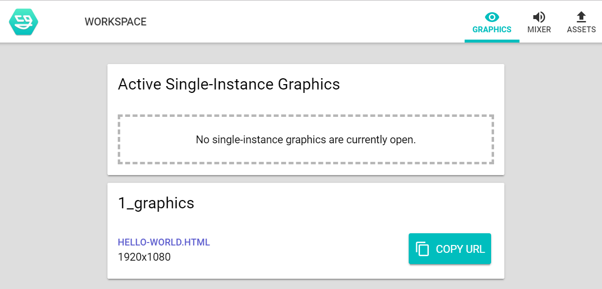

# Graphics

Graphics are visual elements to use on stream. They have access to a global `nodecg` Object for interacting with NodeCG.

Graphics must reside in a `graphics` directory, but can be named anything.

Each Graphic must be identified in the `package.json` using the following `nodecg` schema. The key point to note here is that the `file` specifies a path to the graphic relative to the `graphics` directory.

For more information, see http://nodecg.com/tutorial-manifest.html

```json
"nodecg": {
  "compatibleRange": ">=0.9",
  "graphics": [
    {
      "file": "hello-world.html",
      "width": 1920,
      "height": 1080
    }
  ]
}
```

Note that `graphics` is an array, meaning that you can specify multiple graphics in the same `package.json` - the same applies to dashboard panels.

The full url of graphics as they are served by NodeCG can be found under the Graphics tab in your dashboard. To view the graphic either open the url or copy it and add it as a Browser Source in OBS or your streaming software of choice.


